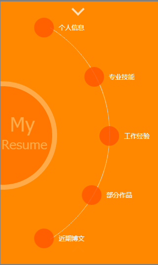

## 手机版简历Demo
包括上下翻页、菜单动画的效果

###Demo截图


###Demo核心代码

####上下翻页功能

```
window.mySwipe = swipe(document.getElementById('slider'), {
    vertical: true,
    speed: 100,
    callback: function(i, elem) {
        pages[index].className = cname;
        cname = elem.className;
        elem.className += ' m-page-cur';
        index = i;
        if(i == 0){
            downbtn.style.display = 'none';
            upbtn.style.display = 'block';
        }else if(i == pages_len-1){
            upbtn.style.display = 'none';
            downbtn.style.display = 'block';
        }else{
            upbtn.style.display = 'block';
            downbtn.style.display = 'block';
        }
    }
});
```
这个翻页功能是在原版swipe.js基础上做的扩展，新增了本次使用到的垂直翻页 ``vertical`` 以及回调函数。

原版官网 http://swipejs.com/

####其他动画
其它动画基本都是通过css3来实现，包括用到的：animation、transform、transition。
JS写了两个函数去配合实现动作

+ setInterv()
```
//定时触发第二页菜单的闪烁效果
setInterv:function(){
	var _this = this,
		j = 0;
	_this.intv = setInterval(function(){
		for (var i = 0; i < _this.navs_len; i++) {
			_this.navs[i].className = _this.navs[i].className == ''?'':'';
		};
		_this.navs[j].className = 'm-pageB-nav-a';
		j++;
		if( j > _this.navs_len-1 ){ j = 0;}
	}, 2000)
}
```

+ messboxShow()
```
//点击菜单下拉相应的内容
messboxShow:function(){
	var _this = this,
		messboxs = document.querySelectorAll('.m-messbox'),
		messboxs_len = messboxs.length;
	_this.delegateEvent(_this.nav, 'a', 'click', function(e){
		var that = this,
			j = that.getAttribute('dataIndex');
		if(j < messboxs_len){
			messboxs[j].className = 'm-messbox m-messbox-on';
			_this.messClose(messboxs[j]);
		}
    });
},
//关闭当前下拉内容
messClose:function(o){
	if(!o){return;}
	var closebtn = o.querySelector('.m-messbox-close'),
		_this = this;
	if(!closebtn){return;}
	_this.addEvent(closebtn,'click',function(){
		o.className = 'm-messbox';
	})
}
```
效果不是很复杂，主要是css3动画的灵活运用以及考虑在使用css3动画是减少触发reflow而使用translate触发GPU硬件加速，提供动画的流畅度。

###Demo在线效果
[Demo在线效果](http://www.w3cmark.com/demo/resume/)


