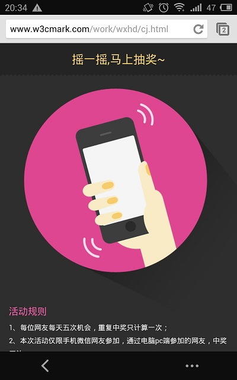

demo
====

## 摇一摇抽奖Demo
包括手机摇一摇效果和礼物下坠的效果

###Demo截图



###Demo核心代码

####手机摇晃检测

```
var SHAKE_THRESHOLD = 2500,
	last_update = 0,x,y,z,last_x,last_y,last_z;
function detectShake(evt) {
	var accl = evt.acceleration,
    	acceleration = event.accelerationIncludingGravity,
		curTime = new Date().getTime(),
		diffTime = curTime - last_update;// 固定时间段
	if (diffTime > 100) {
		last_update = curTime;
		x = acceleration.x;　　　　
		y = acceleration.y;　　　　
		z = acceleration.z;
		var speed = Math.abs(x + y + z - last_x - last_y - last_z) / diffTime * 10000;//自定义的摇晃幅度
		if (speed > SHAKE_THRESHOLD && shake) {
			//alert(speed)
			setTimeout(function(){
				showLw()//检测到手机摇晃触发礼物降落的效果
			}, 500);
		}
		last_x = x;
		last_y = y;
		last_z = z;
	}
}
```

###产生随机图片地址

```
function randomImg(){
	var num1 = Math.random(),
		num2 = Math.random(),
		num = Math.floor(num1*10 + num2*10),
		imgurl,
		imgw = [45,29,48,32,55,36,37,43,29,42,47,43];
		if(num > 12){
			return;
		}
	imgurl = 'img/lw' + num + '_' + imgw[num-1] + '.png';
	imgwidth = imgw[num-1];
	return imgurl;
}
```

###把产生的随机图片放入到页面

```
function createImg(){
	var imgurl = randomImg();
	if(!imgurl){
		imgurl = 'img/lw1_45.png'//随机地址不存在出默认图片
		imgwidth = 45;
	}

	if(!imgDoc){return;}
	var ele = document.createElement('img');
	ele.src = imgurl;
	ele.width = imgwidth;
	ele.style.webkitTransition = 'all '+ dTime +'s ease-out';
	ele.style.top = '-50px';
	ele.style.left = Math.random() * (w-35) +'px';//图片的随机位置
	imgDoc.appendChild(ele);
	dragDown(ele);
}

/*随机图片降落*/
function dragDown(obj){
	setTimeout(function(){
		obj.style.top = h + 'px';
	}, 10);
}

```

###Demo在线效果
[Demo在线效果](http://www.w3cmark.com/work/wxhd/cj.html)

